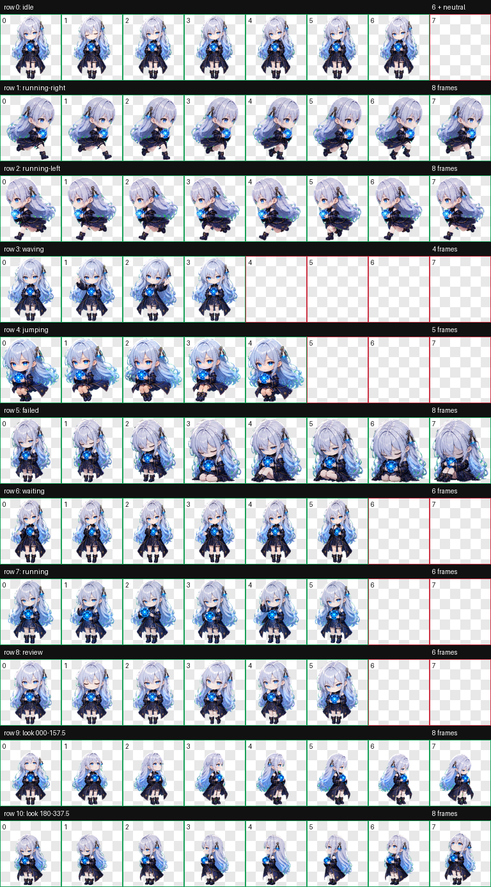
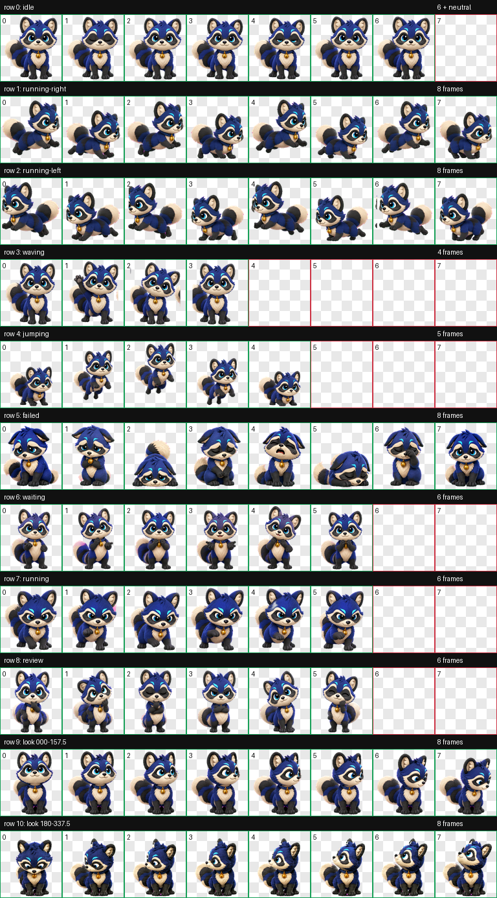
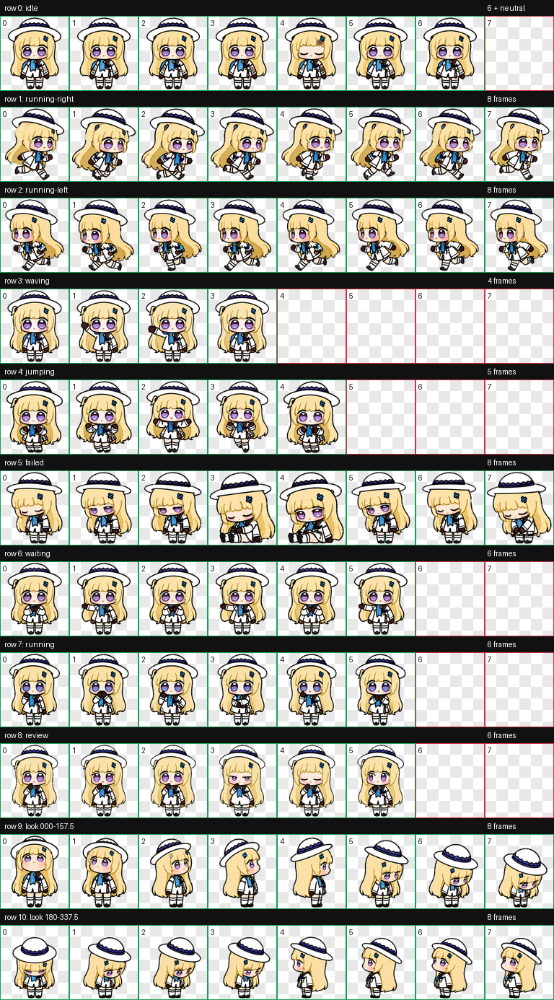

# Spritebell

Spritebell is a growing collection of personal Codex desktop companions. Each pet keeps its runnable package, visual previews, validation evidence, and generation provenance together.

## Pets

### Wonderbell

A chibi silver-haired AI agent operator with a bell ornament and a luminous constellation orb.



- Package: [`pet.json`](pets/wonderbell/pet.json) · [`spritesheet.webp`](pets/wonderbell/spritesheet.webp)
- Preview: [`16 look directions`](pets/wonderbell/previews/look-directions.png)
- Evidence: [`validation`](pets/wonderbell/qa/validation.json) · [`run summary`](pets/wonderbell/qa/run-summary.json)

### Suzu

A thoughtful agent-tanuki who scouts across borders, keeps evidence trails, and rings for human approval before irreversible leaps.



- Package: [`pet.json`](pets/suzu/pet.json) · [`spritesheet.webp`](pets/suzu/spritesheet.webp)
- Preview: [`16 look directions`](pets/suzu/previews/look-directions.png)
- Evidence: [`validation`](pets/suzu/qa/validation.json) · [`run summary`](pets/suzu/qa/run-summary.json)

### 菲比 (Feibi)

A gentle, radiant chibi companion with a lively spirit, known for greeting the workday with “菲比啾比”.



- Package: [`pet.json`](pets/feibi/pet.json) · [`spritesheet.webp`](pets/feibi/spritesheet.webp)
- Preview: [`16 look directions`](pets/feibi/previews/look-directions.png)
- Evidence: [`validation`](pets/feibi/qa/validation.json) · [`run summary`](pets/feibi/qa/run-summary.json)
- Creative direction: [`voice direction`](pets/feibi/provenance/voice-direction.md)

## Install a pet

Copy one complete pet directory into `~/.codex/pets/<pet-id>/`. The two runtime files must remain beside each other:

```text
~/.codex/pets/<pet-id>/
├── pet.json
└── spritesheet.webp
```

The `previews/`, `qa/`, and `provenance/` directories are archive material and are not required at runtime.

## Repository layout

```text
pets/<pet-id>/
├── pet.json
├── spritesheet.webp
├── previews/
│   ├── contact-sheet.png
│   └── look-directions.png
├── qa/
│   ├── validation.json
│   └── run-summary.json
└── provenance/
    ├── pet-request.json
    └── voice-direction.md (when available)
```

Every current pet uses Sprite v2: an 8 × 11 atlas at `1536 × 2288`, with nine standard work-state rows and sixteen clockwise look directions.

> `run-summary.json` and `pet-request.json` intentionally preserve creation-time absolute paths as provenance. They are evidence records, not portable installation manifests.
